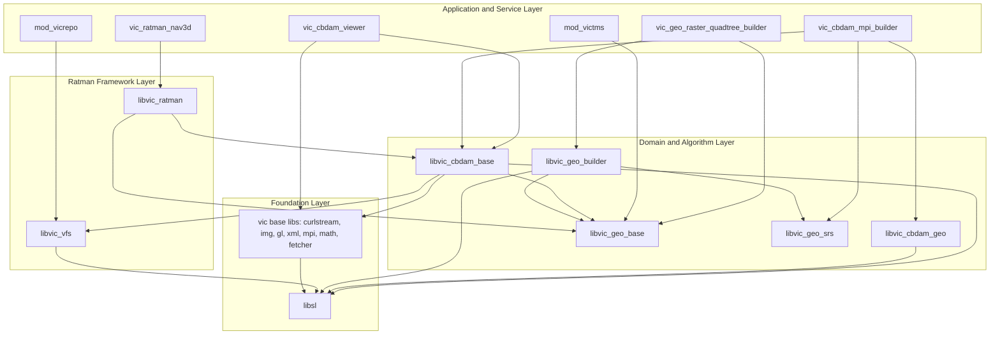
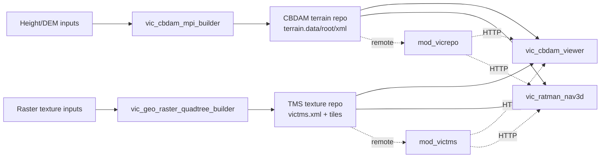

# Legacy Core Architecture Panorama

> Historical topology note: the repository map below describes the source
> workspace before consolidation. Current source, Docker, minimal 1k data, and
> regression ownership live in this monorepo; see `REPOSITORY_SCOPE.md`.

本文档记录当前 legacy terrain stack 的全景架构，用于后续 SDK 化、开源拆分、构建系统升级和应用迁移时统一上下文。

## Repository Map

当前工作区包含三个相邻 Git 仓库和一个数据辅助目录：

- `spacelib/`：底层 `sl` 数学、几何、容器、序列化和编码库，使用 CMake 构建。
- `ratman/`：legacy C++ 核心仓库，包含 base libraries、CBDAM/Geo/Ratman 领域库、Qt/OpenGL apps、Apache modules。
- `terra-sdk-web/`：Docker 构建编排、部署脚本、数据集脚本、验证工具和文档。
- `ps-data/`：本地 PS 数据准备辅助脚本和输入数据。

构建顺序为：

```text
spacelib -> ratman/base -> ratman/ratman -> apps
```

## Layered View



## Application Layer

### `vic_cbdam_viewer`

Source: `ratman/ratman/apps/cbdam/viewer/`

Role: minimal CBDAM terrain algorithm verification viewer. It loads terrain and texture directly from command-line arguments, owns a single OpenGL viewport, and has deterministic verification mode for baseline screenshots/state/log checks.

Primary dependencies:

- `libvic_cbdam_base`
- Qt Widgets/OpenGL
- `libvic_img`
- `libsl`

This is the best end-to-end baseline app for SDK refactoring because it has little product UI and exercises the core CBDAM terrain/rendering path directly.

### `vic_ratman_nav3d`

Source: `ratman/ratman/apps/nav3d/`

Role: full Qt GIS-style application. It reads XML configuration, builds a `QMainWindow`, manages layer UI, bookmarks, search, meteo, compass, atmosphere, snapshots, and a decorated terrain scene.

Primary dependency:

- `libvic_ratman`, which wraps CBDAM through `terrain_renderable`, `decorated_terrain_view`, and `qgl_scene_view`.

This app validates product integration and Ratman scene composition. It should be kept as a smoke/integration target, not as the first SDK boundary.

### `vic_cbdam_mpi_builder`

Source: `ratman/ratman/apps/cbdam/mpi_builder/`

Role: terrain repository builder. It converts height/DEM input into CBDAM repository artifacts:

```text
terrain.data
terrain.root
terrain.xml
```

Primary dependencies:

- `libvic_cbdam_geo`
- `libvic_cbdam_base`
- MPI
- GDAL/SHP

### `vic_geo_raster_quadtree_builder`

Source: `ratman/ratman/apps/geo/geo_raster_quadtree_builder/`

Role: texture/TMS quadtree builder. It creates and updates texture tilemaps:

```text
texture/victms.xml
texture/<level>/<u>/<v>/*.jpg
```

Primary dependencies:

- `libvic_geo_base`
- `libvic_geo_builder`
- GDAL
- MPI on Unix through `vic_geo_builder`

## Service Layer

### `mod_vicrepo`

Source: `ratman/apache_mod_vicrepo/`

Role: Apache module for serving terrain repository data over HTTP. It links against:

- `libvic_vfs`
- `libsl`

It supports remote repository-style access for large terrain data.

### `mod_victms`

Source: `ratman/apache_mod_victms/`

Role: Apache module for TMS tile serving. It has a standalone build path that copies TinyXML, `tilemap_config`, and `victms_conventions` sources instead of linking the full Ratman stack.

It should be treated as a service compatibility component during migration.

## Domain Libraries

### `libvic_cbdam_base`

Source: `ratman/ratman/src/vic/cbdam/base/`

Current responsibility:

- CBDAM diamond graph and terrain repository structures.
- Terrain model, geometry layer, texture layer, texture manager.
- Terrain refinement, patch/tile selection, priority diamonds.
- Local/network geodata fetchers.
- Coordinate transforms.
- Camera and camera controllers.
- OpenGL renderer and cached data renderer.
- Background update thread.

Migration note: this is the main SDK extraction target, but it currently mixes platform-independent algorithms with Qt/OpenGL/network/threading/rendering concerns.

### `libvic_cbdam_geo`

Source: `ratman/ratman/src/vic/cbdam/geo/`

Role: map sampling layer used by terrain builders. It bridges raster/DEM input into CBDAM terrain construction.

### `libvic_geo_base`

Source: `ratman/ratman/src/vic/geo/base/`

Role: TMS and tilemap model layer. It contains `tilemap_config`, TMS resource abstractions, and VICTMS conventions.

### `libvic_geo_builder`

Source: `ratman/ratman/src/vic/geo/builder/`

Role: raster quadtree build pipeline: quad accessors, processors, warpers, transforms, and MPI quad builder.

### `libvic_ratman`

Source: `ratman/ratman/src/vic/ratman/`

Role: application scene framework for nav3d:

- `decorated_terrain_view`
- `terrain_renderable`
- `qgl_scene_view`
- camera controller and animation
- decorations such as atmosphere, compass, labels, bookmarks, meteo, snapshots
- search/network helpers

It is above CBDAM and should be migrated after the CBDAM SDK boundary is stable.

## Foundation Libraries

### `libsl`

Source: `spacelib/src/sl/`

Role: shared C++ foundation:

- fixed-size vectors, matrices, affine/projective/rigid-body maps
- dense arrays and external arrays
- geometry primitives, bounding volumes, kd-tree/octree
- codecs, wavelets, serialization, buffers
- timing, memory, utility helpers

Most legacy libraries depend on `sl`.

### Ratman Base Libraries

Source: `ratman/base/src/vic/`

Important modules:

- `vic_curlstream`: curl-backed stream I/O.
- `vic_fetcher`: async fetcher/thread primitives.
- `vic_img`: image and quadtree image utilities.
- `vic_gl`: OpenGL helpers.
- `vic_xml` / `vic_qxml`: XML models.
- `vic_mpi`: MPI wrapper utilities.
- `vic_math`: numerical optimization.
- `vic_persistent`: persistence helpers.

## Data Flow



## Verification Roles

- `vic_cbdam_viewer`: primary algorithm baseline. Use smoke and interaction verification to detect regressions during SDK extraction.
- `vic_ratman_nav3d`: product integration smoke target. It verifies XML config parsing, Ratman scene setup, CBDAM terrain connection, TMS insertion, and async rendering startup.
- builders: data production validation. They ensure repository formats remain readable by both viewer and nav3d.
- services: remote compatibility validation. They should be verified after local SDK/data format behavior is stable.

## Migration Guidance

1. Protect the existing viewer baseline before moving code.
2. Split `libvic_cbdam_base` into platform-independent core and platform adapters.
3. Keep OpenGL renderer, Qt widgets, and verification UI code outside the core SDK.
4. Preserve repository and TMS file format compatibility until replacement readers/builders are verified.
5. Treat `libvic_ratman` and nav3d as downstream integration clients of the SDK.
6. Migrate Apache modules after local repository/TMS readers are stable, because service behavior is a compatibility layer rather than the core algorithm.

## Initial SDK Boundary Candidate

The first SDK package should focus on:

- repository metadata loading
- coordinate transforms
- diamond graph and terrain patch hierarchy
- LOD/refinement decisions
- patch/tile selection
- texture layer metadata and tile lookup

The first SDK package should avoid:

- Qt widgets and dialogs
- OpenGL rendering
- application-specific camera input handling
- Apache/APXS module code
- nav3d decorations and product UI
