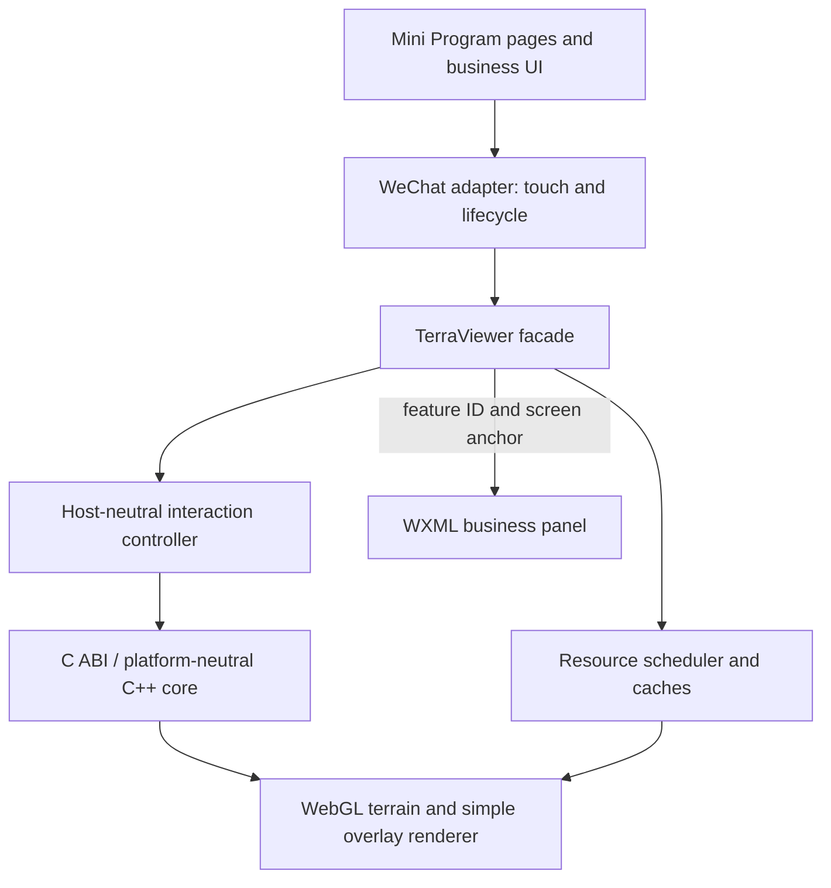

# Terra Lightweight SDK Productization Plan

## 1. Product Definition

平面和 Globe 地形加纹理已经在微信开发者工具中通过可视化验收。下一阶段的目标是把当前验证型 runtime 整理为轻量、稳定、可复用的地形可视化 SDK，而不是建设完整 GIS 引擎。

V1 产品闭环：

- 加载并显示 planar/globe 地形与影像。
- 提供移动端平移、缩放、旋转、倾斜、鸟瞰、指北和 reset。
- 交互过程中无不可控跳变，停止交互后地形和影像逐级收敛。
- 显示一组经纬度 POI 和一条经纬度路线。
- 点击 POI 后向应用返回稳定 ID、坐标和屏幕锚点，由应用展示业务详情。
- 使用同一 SDK facade 支撑 Web 自动化和微信小程序验收。

V1 不包含：

- 通用 GeoJSON source/layer/style 系统。
- SDK 内置历史栈、命名书签、缩略图或 Camera Tour。
- POI 聚合、完整碰撞避让、文字标注和地形深度遮挡。
- 多路线管理、路线拾取、路线跟随、虚线或动画材质。
- 跨日期变更线的完整 GIS 语义。
- 父子纹理 cross-fade、离线地图包和矢量瓦片。
- 任意 HTML 渲染、业务数据请求或隐式 WGS84/GCJ-02 转换。

这些能力只有在出现明确业务场景和性能证据后才进入独立扩展计划。

## 2. Current Baseline

| Area | Current capability | V1 gap |
| --- | --- | --- |
| Camera | C++/C ABI 支持 distance、tilt、yaw 和 Globe target | 缺少原子 ViewState、平面 target、锚点缩放和统一约束 |
| Globe input | 页面每 16 ms 合并拖动、缩放和视角变化 | 平移按 degrees-per-pixel 估算，缺少手势锁定和取消策略 |
| Planar input | 按钮支持 top、zoom、45 度和 reset | 尚无触摸平移、缩放和旋转 |
| Imagery | 请求调度、取消、重试和 LRU | exact tile 未就绪时使用单色 fallback，没有祖先纹理覆盖 |
| Business data | 只有 terrain draw ranges | 无基础 POI、路线、投影和拾取接口 |
| State | runtime state 和 diagnostics | 缺少 camera settle、resource idle 和 feature click 事件 |

nav3d 只作为行为参考：保留相机状态、约束、插值跳转和可序列化视角的思想，不复制 Qt 控件、截图历史、书签服务或旧 OpenGL 代码。

## 3. Lightweight Budgets

以下是 V1 初始门控。Phase 0 必须在 Web、一个支持的 Android 设备和一个支持的 iOS 设备上测量并确认；调整必须单独评审，不能在实现过程中静默放宽。

| Item | V1 budget |
| --- | --- |
| SDK runtime artifacts | 五个核心 JS 文件加 `terra_sdk.wasm` 不超过 512 KiB，应用页面和业务图标不计入 |
| Wasm binary | 继续执行现有 1 MiB 上限 |
| Wasm memory | 最大 64 MiB，不启用线程或 SharedArrayBuffer |
| SDK-managed caches | 默认 record、geometry、texture 合计不超过 40 MiB |
| Interaction frame rate | 评审设备持续交互目标不低于 30 FPS |
| Input latency | 标准触摸输入在两个 animation frame 内反映到画面 |
| POI scale | 最多 256 个已提交 POI；只保证当前视口内基础图标渲染 |
| Route scale | 同时一条路线，最多 2,048 个输入坐标点 |
| Startup/settle | Phase 0 冻结当前 p95，后续不得退化超过 10% |

计划评审时，现有五个核心 JS 文件和 Wasm 合计 167,487 bytes，其中 Wasm 为 86,475 bytes。该数据只用于建立起点，正式证据由构建产物重新生成。

## 4. Target Architecture



C++ 核心继续负责 terrain、camera、LOD、坐标转换和确定性矩阵计算。宿主无关 JavaScript SDK 负责手势状态机、异步资源、基础 POI/路线数据和 WebGL 编排。微信 adapter 只转换平台事件并处理页面生命周期。

V1 不把完整 POI/路线 draw buffers 固化进 C ABI。只在批量投影或地表求交被测试证明需要 native/Wasm 一致性时，增加窄范围批处理函数。

## 5. Responsibility Boundary

| Capability | SDK | Mini Program application |
| --- | --- | --- |
| Touch | 标准输入状态机、阈值、迟滞、帧合并和有限惯性 | 绑定并转发 touch start/move/end/cancel |
| Camera | ViewState、约束、pan/zoom/orbit、预设视角和短动画 | 工具栏、初始业务视角和交互开关 |
| Saved view | ViewState 序列化、校验和恢复 | history/bookmark 栈、名称、缩略图和持久化 |
| Terrain/imagery | LOD、请求优先级、祖先 fallback、缓存和状态事件 | 服务地址、token、网络域名、版权和用户重试入口 |
| POI/route | 坐标校验、投影、基础绘制、POI 拾取和地表采样状态 | 数据获取、业务属性、图标、路线选择和编辑 UI |
| Detail panel | feature click、screen anchor 和 visibility | WXML/自定义组件、内容安全和页面导航 |
| Diagnostics | 结构化状态、错误码、预算和脱敏信息 | 上报策略和用户提示 |

## 6. Camera And Interaction

### 6.1 ViewState

所有相机变化使用一次性提交的 `ViewState`，避免分别更新 target、range、tilt 和 heading 产生中间帧。

```js
{
  schema: 'terra.view-state.v1',
  mode: 'globe',
  target: {
    longitudeDegrees: 116.4074,
    latitudeDegrees: 39.9042,
    heightMeters: 0
  },
  rangeMeters: 1200000,
  headingDegrees: 0,
  tiltDegrees: 45
}
```

平面模式 target 使用 `{ x, y, height }`。公开约定为 `heading=0` 指北、`tilt=0` 鸟瞰、tilt 增大时视角逐渐拉平。现有负 tilt 只在兼容层内部转换。

### 6.2 V1 Camera Interface

```js
viewer.camera.getView()
viewer.camera.setView(view, { animate, durationMs })
viewer.camera.panBy({ xPixels, yPixels })
viewer.camera.zoomBy(scale, { anchor: { x, y } })
viewer.camera.orbitBy({ headingDegrees, tiltDegrees })
viewer.camera.setTilt(tiltDegrees)
viewer.camera.topDown()
viewer.camera.northUp()
viewer.camera.reset()
viewer.camera.cancelAnimation()
```

`panBy` 和锚点 `zoomBy` 使用屏幕射线与 Globe/平面相交计算。SDK 统一约束 target 范围、range、tilt 和相机安全高度。长距离 flight、`fitBounds` 和 Tour 不进入 V1 camera surface；路线适配只提供计算出的推荐 ViewState。

### 6.3 Normalized Input Interface

微信 adapter 将 CSS pixel 和单调时间戳转换为：

```js
viewer.interaction.begin({ pointers, timeMs })
viewer.interaction.update({ pointers, timeMs })
viewer.interaction.end({ pointers, timeMs })
viewer.interaction.cancel()
viewer.interaction.setOptions({ rotateEnabled, tiltEnabled, inertiaEnabled })
```

默认手势：单指平移、双指中心锚点缩放、可选双指旋转、显式 Look 模式倾斜、短按 POI。状态机要求：

- dead zone 区分 tap 和 drag。
- 一次手势锁定 pointer 集合和语义，不中途切换模式。
- 每帧合并输入并限制最大 camera delta。
- 达到边界时丢弃超出量，不累积到后续帧。
- 惯性只在超过速度阈值时启用，并有固定最大持续时间。
- 新触摸立即取消动画和惯性，并以当前相机状态为起点。
- touch cancel、resize 和前后台切换清除所有残留输入。

事件限制为 `interactionstart`、`camerachange`、`interactionend`、`camerasettle` 和 `animationcancel`。应用可在 `camerasettle` 后自行保存 ViewState。

## 7. Terrain And Imagery Continuity

V1 的目标是“始终有可解释覆盖并最终收敛”，不要求父子纹理渐变。

1. 相机变化后保留上一稳定 terrain/texture 内容。
2. exact texture 未就绪时，查找最近可用祖先纹理并重映射 UV。
3. terrain 和 texture 请求按屏幕贡献、中心距离和 LOD 紧迫度排序。
4. exact texture 上传成功后原子替换祖先纹理。
5. 快速往返视角使用短迟滞窗口，避免立即取消仍可能复用的请求。
6. 网络失败继续使用已有祖先纹理，重试不切回单色或空白。

```js
viewer.imagery.setSource({
  id,
  tileScheme,
  minimumLevel,
  maximumLevel,
  attribution,
  resolveTile(tile)
})
```

token 和授权域名由应用注入。SDK 日志只记录 source ID、tile key 和脱敏错误。V1 状态只暴露 `pendingCount`、`failedCount`、`fallbackRatio`、`cacheBytes` 和 `idle`，不建立完整遥测系统。

## 8. POI, Route And Surface Sampling

### 8.1 Narrow V1 Interface

```js
viewer.setPois([
  {
    id: 'poi-1',
    coordinate: [116.4074, 39.9042, 0],
    altitudeMode: 'absolute',
    icon: 'station',
    priority: 10
  }
])
viewer.clearPois()

viewer.setRoute({
  id: 'route-1',
  coordinates: [[116.3, 39.8, 0], [116.5, 40.0, 0]],
  altitudeMode: 'surface',
  color: '#2f7de1',
  widthPixels: 3
})
viewer.clearRoute()
viewer.getRouteView({ paddingPixels: 24 })
```

POI 支持固定图标、锚点、priority、Globe 背面剔除和视锥可见性。V1 不保证标签布局、POI 间碰撞或被山体遮挡时隐藏。相同位置重叠时按 priority 和稳定 ID 排序。

路线支持实线、颜色、透明度、像素宽度和满足当前中国区域场景的 Globe 分段。V1 不提供路线点击、跟随、动画、虚线或全球日期变更线保证。

### 8.2 Height Readiness

`absolute` 直接使用输入高度。`surface` 使用当前已加载 terrain，并显式暴露状态：

```js
viewer.sampleSurface(coordinate)
// { status: 'unavailable' | 'approximate' | 'ready', heightMeters, revision }
```

- `unavailable`：当前没有可用 terrain，POI/路线暂不绘制或使用应用指定 fallback。
- `approximate`：使用父级或较低 LOD，高程可能继续变化。
- `ready`：当前目标 LOD 已满足，但不承诺未来数据版本永不变化。
- terrain refinement 改变 surface 高度时，SDK 更新持有的 POI/路线并发出 `surfacechange`。

这样避免同步 `clamp-to-ground` 隐式返回不稳定值。应用可根据状态显示 loading，不需要重复提交数据。

### 8.3 Picking And UI Bridge

```js
viewer.pickPoi({ x, y })
viewer.project(coordinate)
viewer.on('featureclick', ({ featureId, coordinate, screenPoint }) => {})
viewer.on('featureposition', ({ featureId, screenPoint, visible }) => {})
```

V1 只拾取 POI。点击后应用按 ID 请求业务详情，通过 WXML、自定义组件或受控 `rich-text` 展示。SDK 不接受 HTML，也不负责内容安全、弹窗布局或页面导航。

## 9. Public Facade

```js
const viewer = await TerraViewer.create({
  canvas,
  mode,
  dataset,
  imagery,
  viewport,
  initialView,
  interaction
})

viewer.camera
viewer.interaction
viewer.imagery
viewer.setPois()
viewer.clearPois()
viewer.setRoute()
viewer.clearRoute()
viewer.getRouteView()
viewer.sampleSurface()
viewer.pickPoi()
viewer.project()
viewer.getState()
viewer.on()
viewer.off()
viewer.resize()
viewer.pause()
viewer.resume()
viewer.destroy()
```

`history`、`bookmarks`、`tour`、`sources` 和 `layers` 不出现在 V1 facade。C ABI v1 保持兼容；新增 C ABI 只服务 camera、surface intersection 或批量 projection 的确定性需求，并继续使用 `struct_size` 和版本化结构。

## 10. Delivery Plan

### Phase 0: Freeze Contract And Budgets

- 冻结 ViewState、interaction、imagery、POI、route、surface status 和事件 schema。
- 生成包体、内存、首帧、settle、帧率和输入延迟基线。
- 为现有 planar/globe 相机和纹理选择增加 golden evidence。

Exit：V1 public surface 和预算完成评审；现有可视化及 desktop baseline 不变。

### Phase 1: Camera And Shared Interaction

- 实现原子 ViewState、平面 target、屏幕射线和锚点 pan/zoom。
- 抽离 planar/globe 共用 InteractionController。
- 实现约束、迟滞、有限惯性、取消和 camera settle 事件。
- 小程序页面只保留微信事件转发和工具栏。

Exit：固定触摸序列在 Web 自动化中产生确定 ViewState；快速缩放、切指、边界拖动和 touch cancel 无大范围跳变。

### Phase 2: Ancestor Texture Fallback

- 实现祖先纹理查找、UV 重映射、稳定帧保留和请求优先级。
- 增加请求代次迟滞及精简资源状态。
- 不修改 shader 实现 cross-fade。

Exit：慢网、乱序和失败测试中无空洞或单色闪屏；停止交互后 exact texture 收敛。

### Phase 3: Basic POI And Business Panel Bridge

- 实现受限 POI 数据、批量投影、图标绘制、背面剔除和 POI picking。
- 增加 feature click/position 事件。
- 小程序示例使用 WXML 详情面板，不把业务内容放进 SDK。

Exit：北京固定 POI 可见、可点击并返回正确 ID/坐标；Globe 背面 POI 不响应。

### Phase 4: Single Route And Surface Status

- 实现一条实线路线、基础 Globe 分段和推荐路线 ViewState。
- 实现 `unavailable/approximate/ready` 高程状态和 surfacechange。
- 验证 planar/globe 路线及 terrain refinement 后的稳定更新。

Exit：路线不穿入当前可见地形；LOD 更新不会导致一次性大范围跳变；规模预算通过。

### Phase 5: Release Hardening

- 完成 JavaScript API 文档、TypeScript declarations、错误码、示例和升级说明。
- 验证包体、内存、帧率、输入延迟、context restore 和前后台生命周期。
- 最后执行微信开发者工具、Android 和 iOS 人工验收。

Exit：所有自动门控通过且无编译 warning；人工设备验收只阻塞正式发布声明，不阻塞前序工程实现。

## 11. Regression Gates

| Change | Focused automation | Required regression |
| --- | --- | --- |
| Camera/C ABI | native golden、native/Wasm parity、fixed gesture replay | planar/globe Web captures |
| Interaction JS | pointer state-machine tests、cancel/resize/background tests | planar/globe Mini Program manual check |
| Imagery | ancestor UV、slow network、retry/cancel tests | Web visual convergence |
| POI | projection、stable ordering、backside visibility、picking tests | WXML detail panel check |
| Route/surface | subdivision、height status、refinement tests | planar/globe route capture |
| Release | package size、memory、service/full baseline、zero warnings | DevTools、Android、iOS |

常用门控：

```bash
bash scripts/build_cmake.sh
bash scripts/verify_miniprogram_wasm.sh
bash scripts/verify_planar_web.sh
bash scripts/verify_web_sdk.sh
bash scripts/verify_baseline.sh
bash scripts/verify_globe.sh
```

开发阶段按变更矩阵运行 focused gate；合并 C++/C ABI、renderer 或 release 变更时运行完整门控。只有涉及在线影像时才运行 Tianditu gate。

## 12. Deferred Extensions

以下能力不从 V1 API 预留空对象，也不提前冻结数据结构：

- history、named bookmarks 和 Camera Tour。
- 通用 source/layer/style 与完整 GeoJSON。
- POI label、collision、cluster 和 terrain depth occlusion。
- 多路线、route picking/following、动态材质和全球日期变更线。
- parent/child texture cross-fade。
- 离线包、矢量瓦片、编辑工具和分析能力。

应用现在即可基于 `ViewState` 实现简单书签或历史；只有两个以上应用出现相同需求时，再评审是否进入 SDK 扩展模块。

## 13. Reference Principles

- nav3d 的约束、插值和可序列化相机状态作为行为参考，不复制实现。
- Cesium/Mapbox 的 camera、projection、marker 和 event 分层用于验证接口职责，但不复制其完整 GIS surface。
- 其他小程序 map 组件的 marker、polyline、include-points 和 tap/region-change 模式用于验证移动端基本交互闭环。
