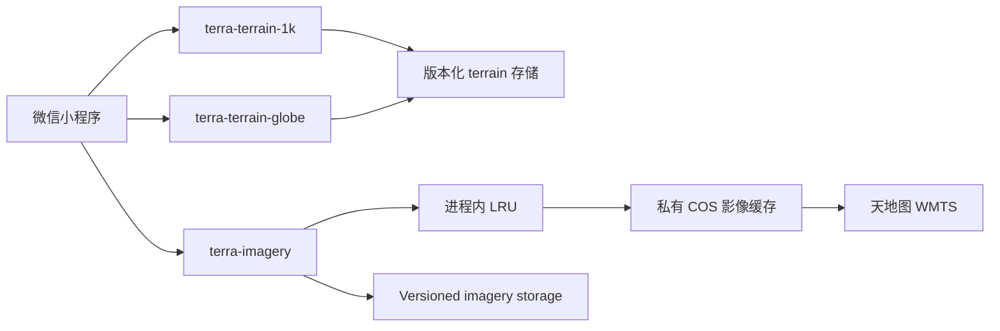

# CloudBase Run Deployment Architecture

## 1. Goal

本文定义 Terra 测试和小程序验收环境在 CloudBase Run 上的部署方案。采用：

> 3 个独立 CloudBase Run 服务 + 版本化 terrain 数据 + 持久化影像缓存。

目标是在不改变当前 terrain HTTP contract 和 SDK 算法行为的前提下，部署
planar 1k、globe terrain 和天地图影像代理，并建立可自动回归、可独立扩容和
可回滚的服务边界。

## 2. Target Architecture



| Service | Responsibility | Storage |
| --- | --- | --- |
| `terra-terrain-1k` | planar 1k terrain HTTP API | read-only COS mount |
| `terra-terrain-globe` | globe CBDAM terrain HTTP API | read-only COS mount |
| `terra-imagery` | static tiles, token protection, validation, and caching | read-only data and read-write cache mounts |

三个服务分别部署、扩缩容和回滚。Terrain 服务不持有天地图 token，影像代理
不解析 CBDAM repository。

## 3. Terrain Data Layout

`terra-testdata` 使用不可变版本目录：

```text
terra-testdata/
  datasets/
    ps-1k/v1/
      terrain.xml
      terrain.root
      terrain.data
      texture.png
      manifest.json
    globe/v1/
      global_srtm_tol2.xml
      global_srtm_tol2.root
      global_srtm_tol2.data
      manifest.json
```

`manifest.json` 至少包含 schema、dataset ID、版本、文件大小、SHA-256、创建时间
和源数据说明。已发布目录不得覆盖；修复数据必须创建 `v2` 或新的语义版本。

1k 与 globe 数据均通过只读 COS 挂载提供。Globe 数据约 820 MiB，上传使用
COS multipart，并校验最终对象大小。当前自动验证已经读取实际 1k patch 和
北京 `116,40` 对应 globe patch；扩大实例数前仍需补充随机读取 P95 延迟与
多实例一致性验证。不满足要求时再评估 CFS，暂不改造 repository 格式。

## 4. Terrain Service Contract

生产镜像使用多阶段构建，只复制 `terra_terrain_service` 和必要运行库：

- 读取 CloudBase `PORT`，监听 `0.0.0.0`；
- 提供 `/healthz` 和 `/readyz`；
- readiness 前检查数据文件和 manifest SHA-256；
- 保持现有 `/terra/v1/datasets/...` API；
- 数据目录只读，容器无状态；
- 正常请求不逐条刷日志，只记录错误和周期统计；
- 当前串行 HTTP 实现先通过多实例扩容，负载测试证明有必要后再替换 HTTP 层。

小程序 terrain 请求优先使用 `wx.cloud.callContainer`。SDK 提供 CloudBase
request adapter，将返回值转换为现有 runtime 所需的 `ArrayBuffer` 和状态结构。
本地开发继续保留 HTTP origin adapter。

## 5. Tianditu Proxy API

代理只接受固定路由：

```text
GET /terra/v1/imagery/tianditu/img-c/{z}/{x}/{y}
```

服务必须：

- 固定上游协议、主机、图层和 TileMatrixSet；
- 校验 `z/x/y` 为整数并位于合法范围；
- 拒绝任意 upstream URL，避免 SSRF；
- 从 CloudBase secret 注入 `TIANDITU_TOKEN`；
- 不在日志、响应、缓存 key 或客户端配置中暴露 token；
- 校验上游状态码、Content-Type、文件大小和图片签名；
- 保留小程序中的 `© 天地图` 可见署名。

## 6. Persistent Imagery Cache

### 6.1 Storage

影像缓存与 terrain 使用同一物理 COS bucket 的独立前缀
`terra-tianditu-cache/`。代理通过 CloudBase Run 的读写 COS 挂载访问缓存，
不依赖实例临时盘，也不把缓存对象写入只读 `terra-testdata/` 前缀。

建议 object key：

```text
terra-tianditu-cache/
  img-c/
    v1/
      z/{z}/x/{x}/y/{y}.jpg
```

`v1` 表示缓存 key 规则版本。图层、投影、样式、TileMatrixSet 或编码发生变化
时提升版本，避免旧缓存被错误复用。

Current `img-c` cache objects use the `.jpg` extension and must validate as
`image/jpeg`. A future source returning `image/png` must use a separate profile or
namespace and the `.png` extension. Cache objects must not use the media-neutral
`.tile` extension.

### 6.2 Cache Levels

- L1：每个代理实例的有界内存 LRU，保存热点瓦片。
- L2：私有 COS，保存长期缓存，是跨实例共享的权威缓存。
- Upstream：只有 L1/L2 未命中或 L2 已过期时才访问天地图。

重启或扩容只会清空 L1，不影响 L2。L1 不是正确性依赖。

### 6.3 Cache Metadata

每个 L2 对象保存以下 metadata：

```json
{
  "schema": "terra-tianditu-cache/v1",
  "fetched_at": "2026-07-28T00:00:00Z",
  "expires_at": "2027-07-28T00:00:00Z",
  "upstream_etag": "",
  "upstream_last_modified": "",
  "content_type": "image/jpeg",
  "size": 0,
  "sha256": ""
}
```

使用 COS object metadata；如果所选 SDK 无法原子更新 metadata，则采用
`<tile>.meta.json` sidecar。瓦片先写临时 key，校验完成后再原子发布，避免
其他实例读取半写入对象。

### 6.4 Expiration Policy

默认配置：

```text
TIANDITU_CACHE_TTL_SECONDS=31536000
TIANDITU_STALE_IF_ERROR_SECONDS=2592000
TIANDITU_NEGATIVE_CACHE_TTL_SECONDS=300
```

- 成功瓦片 TTL 为 365 天。
- 在 `expires_at` 之前，命中缓存必须直接返回，不访问天地图。
- 过期后执行条件请求；上游支持时携带 `If-None-Match` 或
  `If-Modified-Since`。
- 上游返回 `304` 时保留现有瓦片，并把过期时间延长 365 天。
- 上游返回有效新瓦片时校验后替换缓存。
- 上游超时或 5xx 时，在 30 天 stale-if-error 窗口内继续返回旧瓦片。
- 404、无效图片和鉴权失败不得缓存一年；可负缓存 5 分钟以抑制重试。

365 天是目标默认值，上线前必须确认天地图许可和账号策略允许代理及长期缓存；
如条款限制更严格，应通过环境变量缩短 TTL，而不是修改代码。

### 6.5 Concurrency

同一实例使用 singleflight，以标准化 cache key 为粒度合并并发 miss。等待刷新
期间，有过期缓存的请求直接获得 stale 数据；没有缓存的首个请求等待上游。

不同实例可能同时刷新同一瓦片，这是可接受的低概率重复请求。最终发布使用
相同 key 和完整对象校验，保证结果幂等。第一阶段不引入分布式锁。

### 6.6 Client Cache

代理返回：

```text
Cache-Control: public, max-age=31536000, stale-if-error=2592000
ETag: <cached-object-etag>
X-Terra-Cache: L1|HIT|MISS|STALE|REVALIDATED
```

当前测试基线的客户端与云存储缓存均为 365 天。缓存 key 包含版本 namespace；
需要集中失效时提升 `v1`，而不是覆盖旧对象。产品上线前若需要更短的客户端
更新周期，应把客户端 `max-age` 独立配置为 7 天。

### 6.7 Invalidation

- 单瓦片删除：删除 tile 和 metadata。
- 区域失效：按 `z/x/y` 前缀批量删除。
- 全量失效：提升 key schema 版本，例如 `v1` 到 `v2`。
- 不覆盖历史 namespace；确认新版本稳定后再通过生命周期规则清理旧版本。
- COS 生命周期规则只负责清理废弃 namespace，不应早于业务 `expires_at`
  删除当前版本瓦片。

## 7. Security And Observability

需要记录以下指标：

```text
terrain_request_total
terrain_request_error_total
imagery_cache_l1_hit_total
imagery_cache_l2_hit_total
imagery_cache_miss_total
imagery_cache_stale_total
imagery_upstream_request_total
imagery_upstream_error_total
imagery_refresh_duration_ms
```

日志只记录规范化 tile key、cache 状态、耗时和错误类别。禁止记录 token、
完整上游 URL、原始响应体或逐帧信息。缓存 bucket 保持私有，服务使用最小权限
凭据，只允许目标前缀的 `GET/HEAD/PUT/DELETE`。

### 7.1 PG Storage RLS Boundary

CloudBase 控制台中 `terra-testdata` “未配置 RLS，API 访问将被拒绝”的提示
是预期状态，不是 Run 挂载故障。逻辑 PG Storage bucket 与运行时物理 COS
挂载是两条不同访问路径：

- 小程序只调用三个 CloudBase Run 服务，不直接调用 Storage API；
- Run 服务通过专用 CAM 子用户和资源连接访问物理 COS；
- `anon` 和 `authenticated` 角色继续被拒绝访问 terrain 与缓存对象。

因此不得为消除控制台提示而添加公开或全量 RLS。只有产品明确需要客户端直读
Storage API 时，才为指定 bucket、对象前缀和用户身份设计最小 RLS。

当前 `terra-imagery` 的公开 HTTPS 域名仅用于测试验收，因为
`canvas.createImage().src` 需要 URL。它隐藏 token，但不能阻止第三方消耗代理
额度。生产化必须把影像改为 `wx.cloud.callContainer` 取二进制后写临时文件，
或在网关增加鉴权、限流和配额；不得直接沿用无鉴权公开代理。

### 7.2 Mount And Release Contract

CloudBase 将 `VolumeConf.Endpoint` 直接传给 cosfs，必须使用完整 endpoint：

```text
https://cos.ap-shanghai.myqcloud.com
```

源代码构建通过临时灰度版本取得镜像；镜像完成后先回滚该灰度，再以
`ReleaseType=FULL` 发布带 COS 挂载的正式版本。验证必须检查当前承载流量的
版本、`VolumesConf`、`/readyz` 和实际 patch，而不能只检查构建退出码。

## 8. Delivery Phases

1. 部署 `terra-storage-probe`，完成小文件只读挂载和 SHA 验证。
2. 上传并部署 1k terrain，运行 manifest/root/detail 自动门控。
3. 验证 globe 大文件上传和 Berkeley DB 挂载性能，再部署 globe service。
4. 部署天地图代理，先验证无缓存、命中、过期、304、失败回退和并发合并。
5. 接入小程序，完成 planar/globe terrain 与影像人工可视化验收。
6. 固化镜像 tag、数据版本、缓存 namespace 和回滚步骤。

## 9. Acceptance Criteria

- 1k 和 globe 服务使用独立 service name，可以单独回滚。
- Terrain manifest、root、detail 的大小与 SHA 符合基线。
- Globe 北京 `116,40` 自动探针通过，层级和 native/Wasm 结果一致。
- 影像首次 miss 访问上游并写入 COS。
- 同一瓦片第二次请求不访问上游，返回 `X-Terra-Cache: HIT`。
- 未过期瓦片在一年 TTL 内不会主动请求上游。
- 过期瓦片正确 revalidate，失败时返回允许范围内的 stale 数据。
- Token 不出现在小程序、日志、响应、Git 或缓存 key 中。
- 小程序持续显示 `© 天地图`。

## 10. References

- [CloudBase Run service development](https://docs.cloudbase.net/run/develop/developing-guide)
- [CloudBase Run COS mount](https://docs.cloudbase.net/run/deploy/configuring/storage/cos)
- [Mini Program access to CloudBase Run](https://docs.cloudbase.net/run/develop/access/mini)
- [CloudBase custom domains](https://docs.cloudbase.net/run/deploy/networking/custom-domains)
- [Tianditu service terms](https://tianjin.tianditu.gov.cn/static/help/terms.html?type=3)
